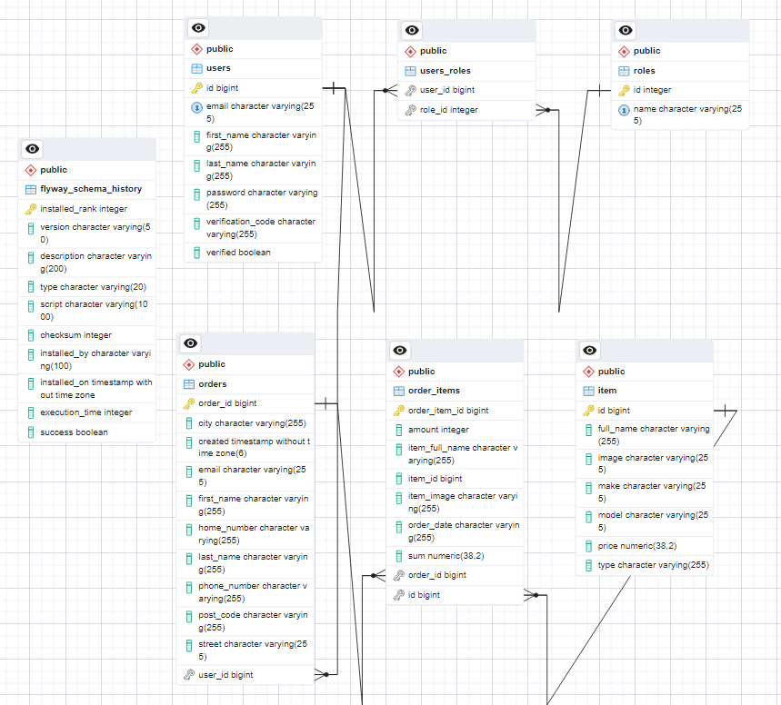

# Tablica zawartości
* [Ogólne informacje](#ogólne-informacje)
* [Technologie](#technologie)
* [Funkcje](#funkcje)
* [Video](#video)
* [Dodatkowe informacje](#dodatkowe-informacje)
* [Uruchomienie](#uruchomienie)

# Ogólne informacje
Projekt przedstawia sklep internetowy, w którym administrator może zarządzać produktami, użytkownicy mogą logować się do sklepu, składać zamówienia, przeglądać historię swoich zamówień i wiele więcej.

# Technologie
* Java 17
* Spring Boot
* Spring Security
* Thymeleaf
* PostgreSQL 16
* HTML
* CSS
* Bootstrap
* Tailwind
* JavaScript
* Docker
* JUnit5 & Mockito
* Flyway

# Funkcje
- System rejestracji/logowania
- Weryfikacja adresu e-mail
- Dodawanie/aktualizacja/usuwanie produktów w sklepie
- Administrator może modyfikować lub usuwać produkty z panelu administratora lub bezpośrednio ze strony sklepu
- Strony z produktami
- System zamówień
- System koszyka
- Panel administratora, w którym admin może przeglądać listy: użytkowników, produktów, zamówień
- Administrator może dodawać uprawnienia administratora innym użytkownikom
- System zmiany hasła
- System przypomnienia hasła
- Autoryzacja i uwierzytelnianie użytkownika
- Automatyczne uzupełnianie danych użytkownika podczas składania zamówienia, jeśli jest zalogowany
- Użytkownicy mogą przeglądać swoje zamówienia
- Sortowanie produktów

# Video 
By obejrzeć video, proszę nacisnąć obraz:

# Dodatkowe informacje
schemat bazy danych:

  

Pokrycie testami wynosi 81%:

# Uruchomienie
1. Sklonuj repozytorium komendą: git clone https://github.com/KamilRusinRepo/WebStoreJava.git
2. Wejdź do nowo utworzonego folderu: cd WebStoreJava
3. Zbuduj plik .jar: ./mvnw clean package
4. Uruchom plik docker-compose: docker-compose up --build
